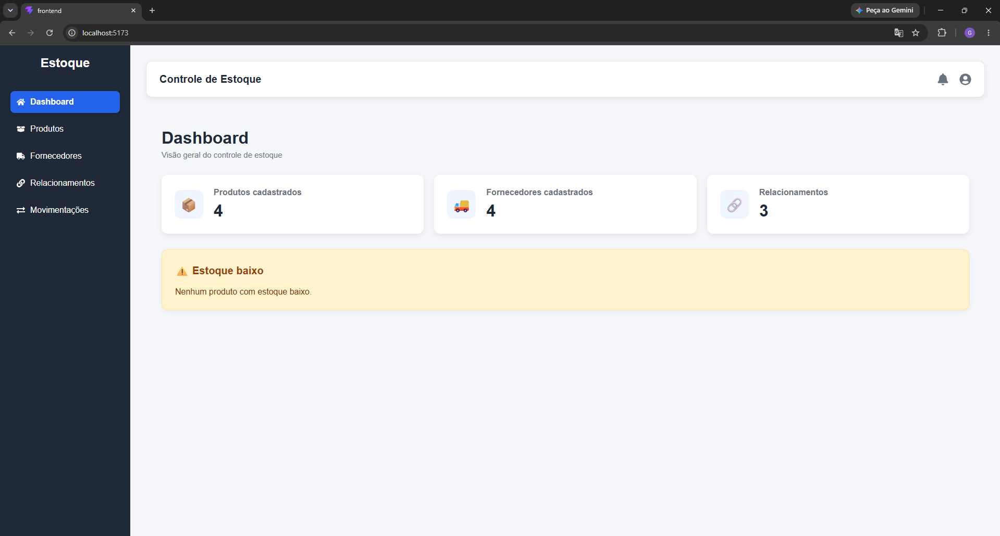
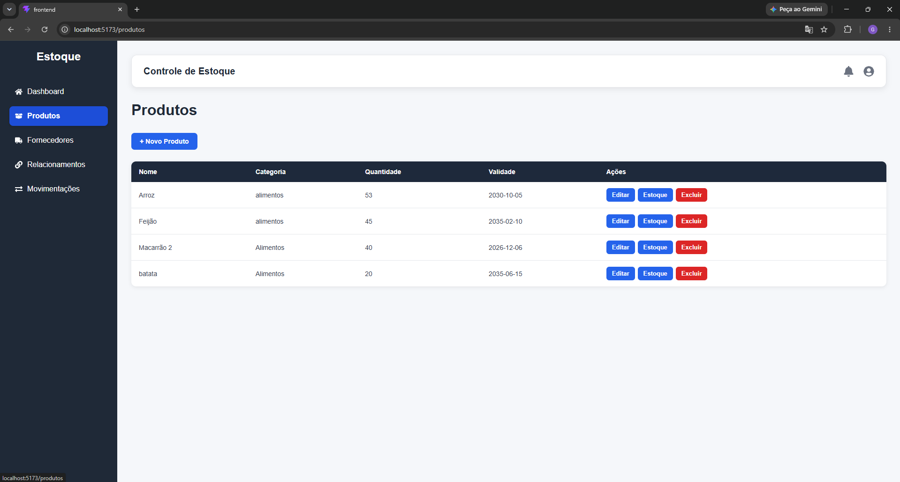
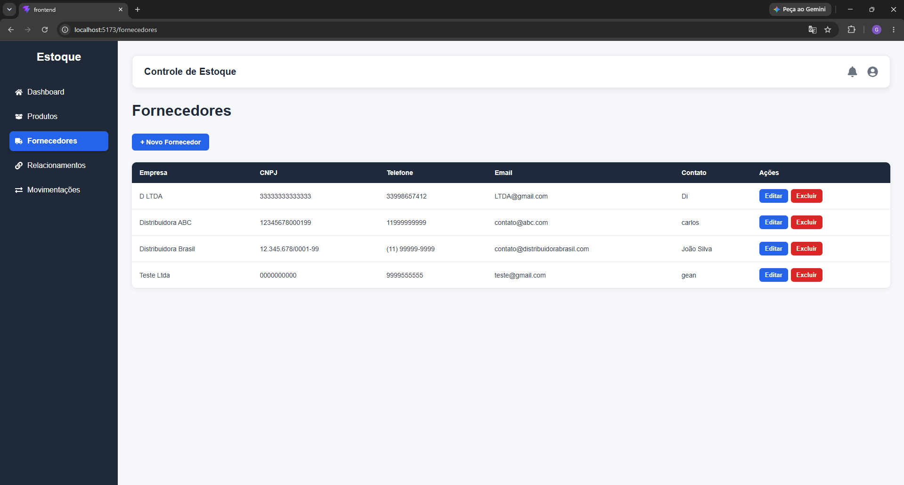
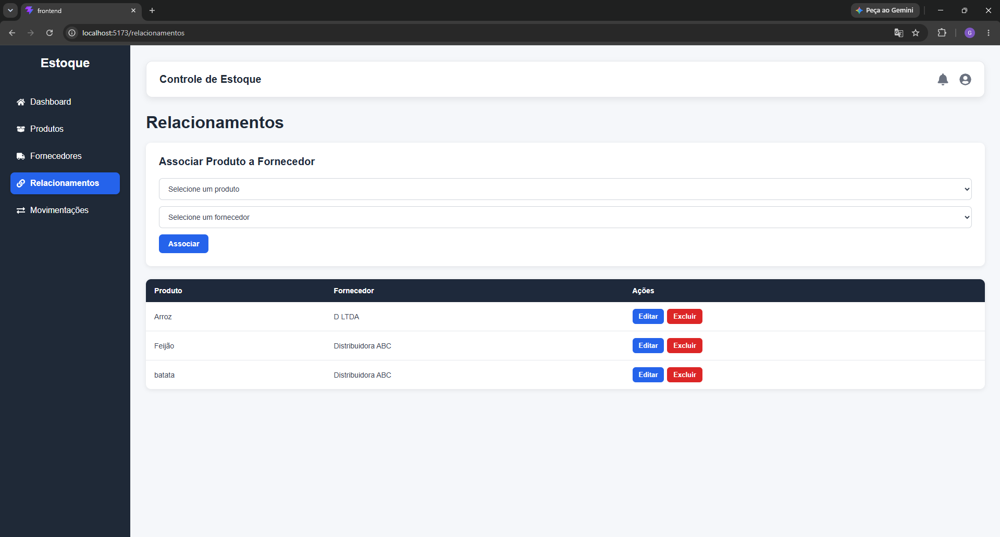
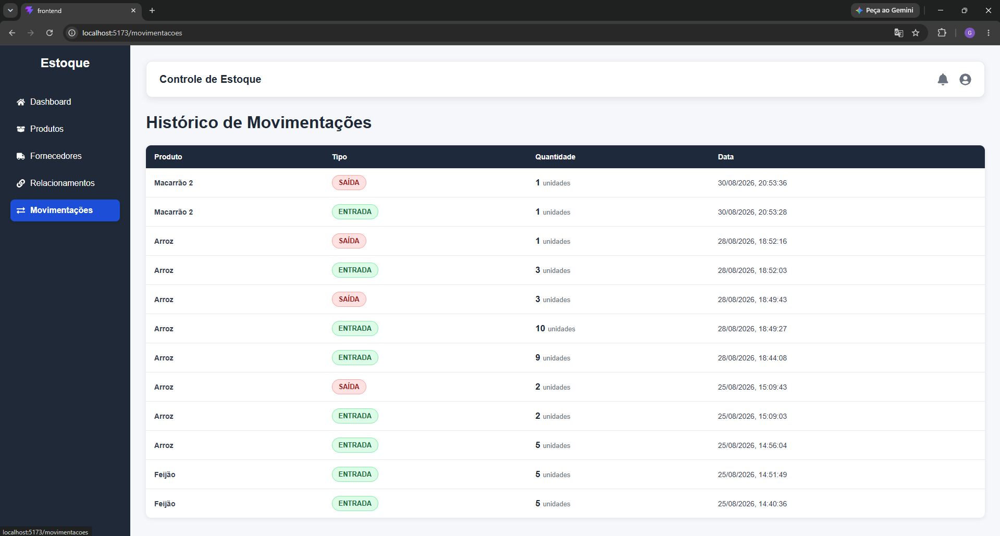

# 📦 Controle de Estoque

Sistema web Full Stack para gerenciamento de estoque, desenvolvido como Projeto Integrador do curso de Análise e Desenvolvimento de Sistemas.

A aplicação permite gerenciar produtos e fornecedores, estabelecer relacionamentos entre eles, acompanhar o estoque e registrar movimentações de entrada e saída por meio de uma API REST.

---

## 🚀 Funcionalidades

### 📊 Dashboard

- Visualização resumida das informações do estoque.
- Quantidade de produtos cadastrados.
- Indicadores relacionados ao estoque.
- Identificação de produtos com estoque baixo.

### 📦 Produtos

- Cadastro de produtos.
- Listagem de produtos.
- Edição de produtos.
- Exclusão de produtos.
- Controle da quantidade em estoque.
- Informações como:
  - Nome
  - Código de barras
  - Descrição
  - Quantidade
  - Categoria
  - Validade
  - Imagem

### 🏢 Fornecedores

- Cadastro de fornecedores.
- Listagem de fornecedores.
- Edição de fornecedores.
- Exclusão de fornecedores.
- Armazenamento de informações como:
  - Nome da empresa
  - CNPJ
  - Endereço
  - Telefone
  - E-mail
  - Contato principal

### 🔗 Relacionamentos

- Associação entre produtos e fornecedores.
- Listagem dos relacionamentos cadastrados.
- Edição de relacionamentos.
- Exclusão de relacionamentos.
- Relacionamento entre tabelas no banco de dados.

### 📈 Movimentações de estoque

- Registro de entradas de estoque.
- Registro de saídas de estoque.
- Atualização da quantidade disponível.
- Histórico das movimentações realizadas.
- Identificação do tipo de movimentação.
- Registro da quantidade e data da movimentação.

---

## 🛠️ Tecnologias utilizadas

### Frontend

- React
- Vite
- React Router
- Axios
- React Icons
- CSS

### Backend

- Node.js
- Express
- CORS
- SQLite
- sqlite3

### Ferramentas

- Visual Studio Code
- Git
- GitHub
- Insomnia
- DB Browser for SQLite

---

## 🏗️ Arquitetura

O projeto foi desenvolvido utilizando uma arquitetura separando frontend e backend.

```text
Frontend (React)
       │
       │ HTTP / API REST
       ▼
Backend (Node.js + Express)
       │
       ▼
Banco de dados SQLite

---

## 🖥️ Screenshots

### 📊 Dashboard



### 📦 Produtos



### 🏢 Fornecedores



### 🔗 Relacionamentos



### 📈 Movimentações

